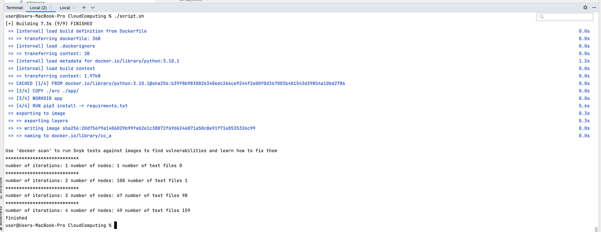

# Cloud Computing Assignment #1

## how to run
1. install [docker](https://www.docker.com/)
2. `./script.sh`

the script will create a docker image with the python code then run it from inside

## file explanation
[input](./src/input.txt) file contains list of sites  
[code](./src/code.py) python script  
[requirments](./src/requirments.txt) python dependencies
## ALGORITHM
the script will hit get request to url then parse html and visit all links inside with max depth of 5

